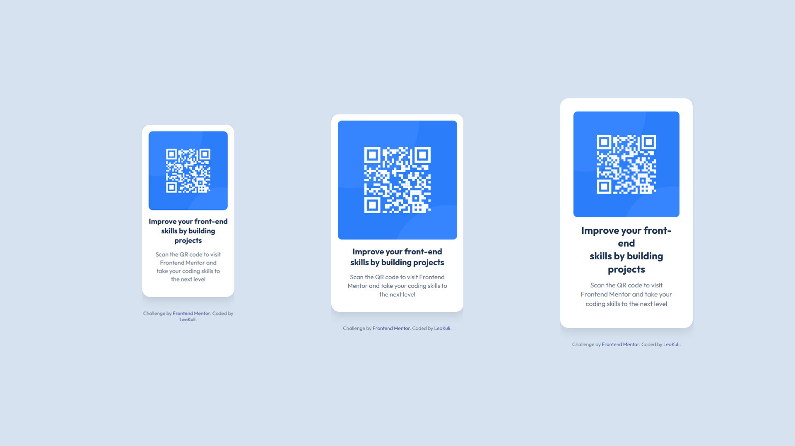

# Frontend Mentor - QR code component solution

This is my solution to the [QR code component challenge](https://www.frontendmentor.io/challenges/qr-code-component-iux_sIO_H) on Frontend Mentor. The goal was to build a responsive QR code component based on a given design.

## 📸 Screenshot



## 🔗 Links

- [GitHub Repository](https://github.com/LeoKuli/Challenge-01-QR-Component)
- [Live Site]("") 

## 🛠️ Built with

- Semantic HTML5
- CSS3 with custom variables
- Flexbox
- Mobile-first design
- Responsive layout with media queries

## 🚀 What I learned

While working on this project, I practiced and reinforced:

- How to vertically and horizontally center elements using Flexbox
- Applying relative units (`rem`, `%`, `vh`) for responsive layouts
- Creating modern card UI with rounded corners and subtle shadows
- Importance of spacing and typography hierarchy

I also learned to pay close attention to design details and test across different screen sizes for consistency.

```css
.card {
  background-color: white;
  padding: 1.5rem;
  border-radius: 1rem;
  box-shadow: 0 1rem 2rem rgba(0, 0, 0, 0.1);
}
```

## 📊 Web Analytics (Vercel)

To track visitors and page views, I integrated [Vercel Web Analytics](https://vercel.com/docs/analytics) by injecting the script directly into the HTML file.

The following lines were added at the bottom of the `<body>` section:

```html
<!-- Vercel Web Analytics -->
<script>
  window.va = window.va || function () {
    (window.va.q = window.va.q || []).push(arguments);
  };
</script>
<script defer src="/_vercel/insights/script.js"></script>
```

## 🔄 Continued Development

Moving forward, I plan to improve:

- 🎯 **Pixel-perfect alignment** with the original design specifications  
- ✨ **Smooth transitions** for hover and focus states  
- 🎨 **Use of CSS custom properties** for better theme control and scalability

I also aim to experiment with:

- 🧪 [**SASS**](https://sass-lang.com/) – to write more modular and maintainable CSS  
- ⚡ [**Tailwind CSS**](https://tailwindcss.com/) – to increase development speed with utility-first classes

---

## 📚 Useful Resources

- [🔧 CSS Tricks – Flexbox Guide](https://css-tricks.com/snippets/css/a-guide-to-flexbox/)  
  Excellent visual guide for understanding and mastering Flexbox.

- [🔤 Google Fonts](https://fonts.google.com/)  
  Great resource for selecting and testing typography.

- [🔍 Figma Viewer](https://www.figma.com/)  
  Helps to inspect design specifications with precision.

- [📝 Markdown Guide](https://www.markdownguide.org/)  
  Useful for writing clean, structured, and readable markdown files.

---

## 👤 Author

- GitHub – [@LeoKuli](https://github.com/LeoKuli)  
- Frontend Mentor – [@LeoKuli](https://www.frontendmentor.io/profile/LeoKuli)

---

## 🙌 Acknowledgments

Thanks to the amazing [Frontend Mentor](https://www.frontendmentor.io) community for providing high-quality, real-world challenges that help us grow as developers.

If you have any **suggestions** or **feedback**, I’d love to hear from you!  
Feel free to open an issue or leave a comment in the repo.
